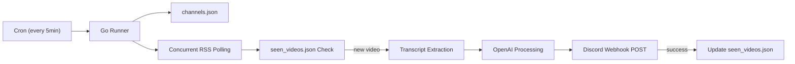

# YouTube Ads Monitor

A Go microservice that monitors selected YouTube channels, detects newly published videos, drafts high-signal YouTube comments with an LLM, and delivers the output to Discord.

This project is designed for cron-based automation: fast startup, concurrent polling, and clean exit after each run.

## Initiative

The goal is to reduce manual effort in staying on top of new technical videos and writing quality engagement comments.  
Instead of watching every upload immediately, this service:

- tracks channels you care about,
- detects only new uploads,
- extracts transcript context,
- generates summary + comment drafts,
- pushes everything to your phone via Discord webhook.

## Technical Architecture



## How It Works

1. **Input + state**
   - Reads target channel IDs from `channels.json`.
   - Reads prior processed video IDs from `seen_videos.json`.

2. **Concurrent trigger**
   - Fetches YouTube RSS feeds in parallel using goroutines + `sync.WaitGroup`.
   - Parses each feed for the latest video.
   - Skips videos already present in state.

3. **Transcript extraction**
   - Uses `youtube-transcript-api-go` to fetch transcript text (best-effort).
   - If transcript is unavailable, pipeline continues with fallback context.

4. **LLM generation**
   - Sends metadata + transcript to OpenAI.
   - Produces:
     - 2-3 sentence summary
     - Timestamp Hero comment
     - Inside Joke comment
     - Value Add comment

5. **Delivery + persistence**
   - Sends structured payload to Discord webhook.
   - Updates `seen_videos.json` only after successful webhook delivery.

## Project Structure

```text
.
├── main.go          # Pipeline orchestrator
├── config.go        # .env and channels loading
├── rss.go           # RSS polling + XML parsing + concurrency
├── transcript.go    # Transcript fetch wrapper
├── llm.go           # OpenAI request/response handling
├── discord.go       # Discord payload formatting + POST
├── state.go         # State load/save + pruning + atomic write
├── channels.json    # Channel input list
├── .env.example     # Environment template
├── Makefile         # Common dev commands
└── scripts/
    └── test_webhook.sh
```

## Requirements

- Go 1.22+ (project currently builds with newer versions too)
- OpenAI API key
- Discord webhook URL

## Quick Start

```bash
cp .env.example .env
# fill in values

go mod tidy
make build
make run
```

## Configuration

Use `.env`:

```env
OPENAI_API_KEY=sk-xxxxxxxxxxxxxxxxxxxx
OPENAI_MODEL=gpt-4o-mini
DISCORD_WEBHOOK_URL=https://discord.com/api/webhooks/XXXX/XXXX
CHANNELS_FILE=channels.json
STATE_FILE=seen_videos.json
```

`channels.json` example:

```json
[
  {"channel_id": "UCxxxxxx", "name": "Example Channel"}
]
```

## Running with Cron (24/7 style)

Edit crontab:

```bash
crontab -e
```

Add:

```cron
*/5 * * * * cd /path/to/youtubeads && ./youtubeads >> /var/log/youtubeads.log 2>&1
```

## Make Commands

- `make build` - compile binary
- `make run` - build and execute
- `make fmt` - format source files
- `make vet` - static analysis
- `make test` - run tests
- `make tidy` - clean module dependencies
- `make clean` - remove local artifacts
- `make help` - show command list

## Testing

Run tests:

```bash
make test
```

Current tests cover core utility logic (state handling and parsing/truncation helpers) and are intentionally simple to keep feedback fast.

## Reliability Notes

- Per-channel failures are isolated; one bad RSS/transcript call does not crash the run.
- State writes are atomic to reduce corruption risk.
- If webhook delivery fails, the video is not marked as seen, so it can retry on the next run.

## Security Notes

- Never commit `.env`.
- Keep webhook URLs and API keys private.
- Rotate credentials immediately if leaked.
